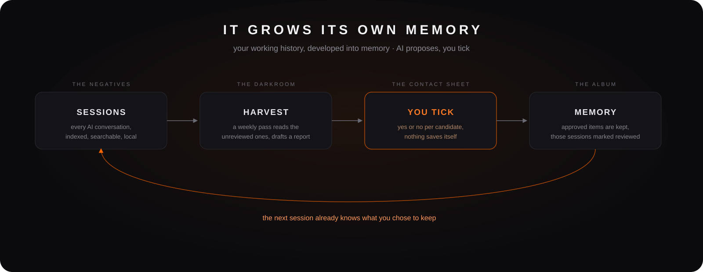
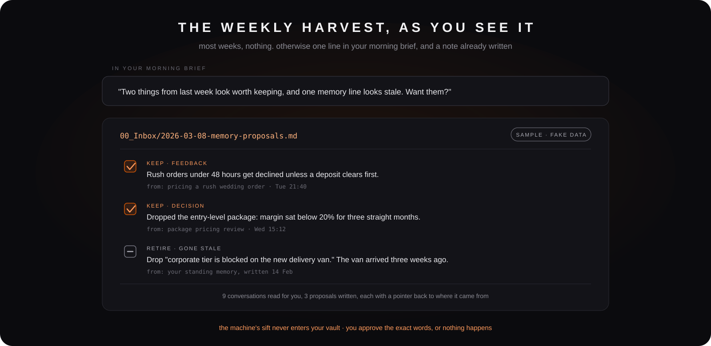
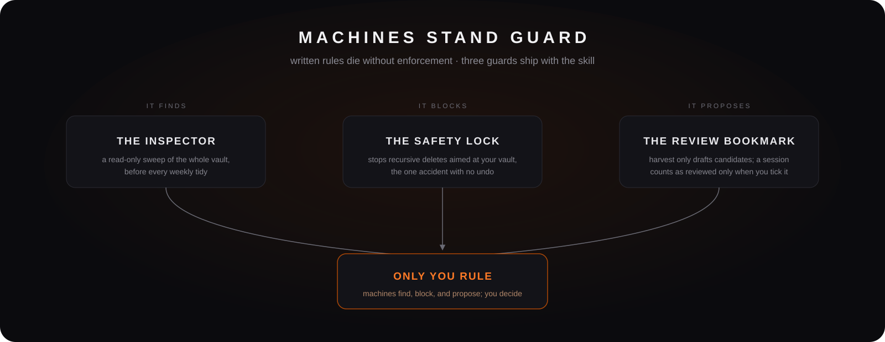

<p align="center">
  
</p>

# My Second Brain

**The one asset that stays yours no matter which AI model ships next quarter.**

A Claude Code skill that builds and runs a complete second brain for a business owner: one vault, two wings (your life in a personal wing, your business in a four-layer knowledge map), operated in plain conversation, with Obsidian as the viewing deck.

And it does the two things note systems never do: it **grows its own memory** (every AI conversation becomes searchable history, and once a week the AI reads what is new and hands you a handful of already-written memory proposals; nothing is kept until you approve the exact words), and it **keeps machines on guard** (a read-only inspector that sweeps the vault, plus a safety lock that blocks the one delete you cannot undo). The rules are not just written down; they are enforced.

## Install

```bash
npx skills add -g breakthrough-edu/my-second-brain
```

The `-g` is not optional here: without it the install lands in the current project folder, and this skill has to sit at the user level to find its own payload.

Then open Claude Code and say:

> set up my second brain

Ten minutes later you are looking at the graph view of your half-built brain.

Already running it? Updating to the latest version is one line, and it never touches your vault, only the skill files.

⚠️ **Read this before you update, if your vault was built before August 2026.** The vault's shape changed in that release: the business wing moved and gained an activity layer, folder doors changed name, and one frontmatter field was renamed. Because an update never touches your vault, **an older vault and a newer skill no longer describe the same house**, and the skill now notices instead of proceeding as though they matched. What that means in practice: it will tell you, in specifics, which parts differ; reading, answering, searching and the morning brief go on working; **and it will decline to move your files or open new rooms until you say what you want** (Capture and the tidy scan are the two that stop). Nothing is changed or deleted, and no migration runs behind your back. **There is no migration tool yet**: moving a house full of real content is its own piece of work, and it is not written. If your vault is fine as it is, staying on your current version is a legitimate choice.

```bash
npx skills update my-second-brain
```

One thing the update command cannot do: the two machine guards (the safety lock and session memory) are offered during Setup, so a vault built before they shipped will not have them yet. Say **"add the safety lock"** or **"set up session memory"** in any session and the skill retrofits the one you asked for onto your existing vault.

For the same reason, the weekly harvest rhythm lives in the command-base skill Setup generated for you, and an update never touches generated skills. A vault built before it shipped keeps the ask-first doorbell; say **"update my harvest doorbell"** to bring the new one over.

## The idea underneath

AI execution is cheap now. What is scarce is your data having a home.

When your business lives in one structured vault, any AI can give you real answers about your own operation. When it lives in chat threads, receipts, and one employee's head, no model, however smart, can help you.

So this skill does not try to be the smartest assistant. It builds the thing underneath the assistant: a knowledge base in plain markdown files, structured by written law, owned by you. Models keep changing; your knowledge base stays yours. Your judgment and your operation are never locked into any single AI vendor, because the data layer is just files on your disk.

## Where most second brains fail

The idea only works if the vault survives contact with daily life, and this is where most second brains lose. They keep dying the same few deaths; every opinionated choice in this system exists to dodge one of them. If you have built one before, at least one of these will feel familiar:

| The usual death | What this system does instead |
|---|---|
| **Collect, never settle.** Capture keeps adding until the vault is a junk drawer nobody trusts. | A weekly distill ritual with teeth: a read-only inspector script scans first, then proposals, you rule. See the loop section below. |
| **One sorting logic for everything.** Life and business forced into one tree, so filing turns into guesswork. | Two wings, kept apart on purpose: life rooms on one side, the business laid out by knowledge type on the other. |
| **Rules live in nobody's head.** Filing by mood; consistency dies the day you switch tools or models. | A written constitution inside the vault, plus a filing log, and the inspector checks the vault against it every week. The rules outlive the model. |
| **The AI writes your "insights".** Auto-generated methodology reads smart and belongs to no one. | The methodology layer accepts only what you reviewed and approved, and only your approval can mark anything as reviewed. AI proposes, you rule. |
| **The vault becomes a shadow ERP.** Invoices and receipts flood in until maintenance collapses under the volume. | The rows iron law: high-frequency data stays in the systems built for it; the vault keeps pointers and exceptions. |

## What you get: four modes

<p align="center">
  
</p>

**Setup** (10 min). Installs Obsidian if needed, builds a fully wired vault (every room has a front desk, navigation live from day zero), asks 3 questions (your business name, and whether you have outlets or equipment), offers an optional calendar connection so your morning brief sees the day's schedule, and generates a **personal command-base skill named after your business**. You install one skill; it builds you another one that only fits you.

**Capture** (15 min per room). Your Business Profile first, then one room at a time: clients, products, SOPs, whichever you pick. One question at a time, talking is fine, and there is a bulk lane when you already have material. Every session ends with one observation about your business you had not noticed, plus two good questions.

**Distill** (10 min weekly). The AI tidies the vault (orphans, misfiles, stale maps), then proposes distillations: decision patterns, lessons, rollups. You only rule yes or no. The third layer of your business map fills from your judgment, never from raw capture.

**Create-My-Jarvis** (45 to 60 min, at home). Two interviews, one about you and one about the character, that give your AI a real persona and a real understanding of who you are, so it stops sounding like a vending machine.

## The structure it builds

<p align="center">
  
</p>

```
Your-Vault/
├── 00_Inbox · 01_Daily            shared capture + the one journal
├── 02_Command-Base/               the desk above both wings: Home, Decisions, Reviews, Resources, dashboard
├── 03_Personal-Wing/              your life: personal projects + six life rooms
├── 04_<Your-Business>-Business-Wing/     your business, four layers:
│   ├── 01_Assets                  what it is made of (clients, vendors, people, docs, systems, brand)
│   ├── 02_Work                    what is moving: every project in one of four lanes
│   ├── 03_SOP                     how things get done (starts empty, one process one note)
│   └── 04_Methodology             why you decide the way you do (fills from judgment only)
├── 98_Archive/                    retired things
└── 99_Meta/                       the constitution, templates, state
```

**The numbers tell the story of the business**: what it is made of, what is moving, how things get done, why you decide the way you do. The activity layer is the one most vaults are missing, and it is where the work you are actually carrying lives.

**Four lanes, and they are not departments.** A project goes to **Deliver** (work for a named customer), **Grow** (aimed at people who have not bought yet), **Run** (recurring upkeep that would exist even with zero growth), or **Build** (finite internal work that leaves the business different). You ask those four questions in order and the first yes wins. No vault-wide argument about whether something is "marketing" or "sales", because this house has no departments to argue about.

## Day to day: living with it

After Setup, your daily driver is the command-base skill it generated for you. A normal day looks like this:

| You say | What happens |
|---|---|
| "morning" | A brief: today's schedule (if a calendar is connected), tasks due, red flags, who you are waiting on, business renewals coming up, and about once a week one line from the session harvest if it found something worth keeping |
| "client X finally signed, closed at RM 4,500" | Captured on the spot, buffered durably, compiled into your daily note at end of day |
| "we decided to drop the entry-level package" | A structured decision record, filed in the central Decisions room with domain and reasoning |
| "follow up with the printer on Friday" | A waiting-for task that will resurface on its own |
| "how do we onboard a new hire again?" | Answered FROM your own SOP note, and if the answer reveals the SOP is stale, it gets updated in the same move |
| "how did we fix this last time?" | Answered from your searchable session history, if session memory is installed, instead of re-deriving a solved problem |
| "compile" (end of day) | The day's captures become one dated daily note. There is one journal, shared by both wings |
| "distill" (weekly, 10 min) | Vault hygiene scan, then distillation proposals for your methodology layer. You rule yes or no |

The handbook stays alive because answering and updating are the same motion. The vault stays trustworthy because every filing decision follows written law.

## The loop that keeps it alive

Most second brains die the same death: capture keeps adding, nothing ever settles, and three months in, the vault is a junk drawer the owner no longer trusts. The weekly Distill ritual is this system's answer, and it is where the compounding happens.

<p align="center">
  
</p>

Say "distill" once a week and four things happen, in order:

1. **Tidy scan.** Seven hygiene checks across the vault: orphan notes, misfiled items, stale maps, and the rest. The AI reports; files move only after you approve.
2. **Distillation proposals.** The AI reads the week's decisions, session logs, and daily notes (and, when session memory is installed, your unreviewed AI conversations), then proposes what they add up to: a decision pattern, a lesson, a rollup.
3. **You rule.** Yes or no on each proposal. Nothing writes itself into your methodology layer, ever.
4. **The methodology layer grows.** Approved distillations land in `04_Methodology` as your own reviewed judgment. The same pass also watches for a playbook that has earned a live feedback loop, and for one that has gone quiet.

This is the part most tools skip, because it cannot be automated away: the loop only compounds if a human keeps ruling. Ten minutes a week is the whole price. In exchange, the answers your AI gives you stop being generic, because they are grounded in what you actually decided, reviewed, and signed off on.

**A machine does the hygiene half.** The mechanical checks in step 1 (stray folders outside the numbered structure, missing control files, off-vocabulary tags, records with holes in their frontmatter, maintenance that has gone stale) are run by the inspector, a small read-only script, before the human scan starts. Distill runs it for you, and it reports in seconds, grouped by severity. It is strictly report-only: it never moves, renames, or deletes a single file. It finds; you rule. That is the same contract as the rest of the loop, just enforced by a script instead of your attention, so your ten minutes go to the judgment calls a machine cannot make.

## It grows its own memory

Most AI setups have amnesia: every conversation starts from zero, and the fix you found in April gets re-derived in July. **Session memory** (optional, offered at setup, macOS first) closes that gap:

<p align="center">
  
</p>

- **Every conversation becomes searchable.** A small local tool indexes Claude Code's own transcripts into a full-text search database, so "how did we solve that before?" gets answered from history. It reads only the transcripts, read-only; it writes only its own database in `~/.my-second-brain/`; it is purely local, with no network code and no background process.
- **A weekly harvest proposes memories.** Once a week, while your morning brief is being prepared, the AI reads the conversations nobody has reviewed yet and curates them down to at most 3 to 5 proposals: each already written to the point where yes is the only action left, each with a pointer to the conversation it came from, plus any standing memory line that looks stale enough to retire. A quiet week ends in silence. A week with something in it costs one line in the brief and a ten-second yes. The pass marks what it read as reviewed so nothing is re-proposed forever; the conversations stay indexed and searchable either way. Nothing enters the files your AI loads at session start until you have seen the exact words. Prefer to be asked each time? Set `harvest_auto: false` in `99_Meta/bootstrap-progress.md`.

<p align="center">
  
</p>

Same law as everywhere else in this system, now with your own past conversations as one of the inlets: the AI proposes, you rule, including proposing what to retire, because a memory that only ever grows goes stale. That is what "grows its own memory" means here, and it is the part a notes app cannot copy, because the raw material is your working history with the AI itself.

## Machines stand guard

Written rules die without enforcement, so the rules that matter most are backed by machinery, all of it shipped in this skill:

<p align="center">
  
</p>

- **The inspector** (`scripts/checkup.py`): a read-only hygiene sweep over the whole vault, run before every weekly tidy.
- **The safety lock** (optional setup step, macOS only): a hook that blocks recursive deletes aimed at your vault or your skills folder, the one category of accident there is no undo for.
- **The draft firewall** in session memory: the machine's weekly sift is written to the tool's own state directory, never into your vault. Only what an AI has actually read and drafted reaches your Inbox, and only words you approved reach the memory your AI loads at session start.

One contract across all three: machines find, block, and propose. Only you rule.

## Create-My-Jarvis: your AI gets a character

Out of the box, every AI assistant is the same person: helpful, generic, nobody's. The fourth mode is where that ends, and it is the part owners remember.

Two interviews, done at home in a quiet hour:

- **The profile interview** (ten questions) writes down who you actually are: how you really make hard decisions (the pattern, not the aspiration), what kind of criticism lands with you, what money does for you. Answers are transcribed near verbatim. Thin answers make a thin profile, and the skill says so instead of inventing personality to fill the gaps.
- **The soul interview** (eight beats) has you author a character: its name and why the name matters, what it should do first when you ship something hard, what it should do first when you are stuck, what it must never do, and at least three voice rules concrete enough to test a single sentence against.

A hard **genericness gate** protects the result. "Be clear and concise" fails the gate. "Never open with 'Great question'. If I write in Chinese, answer in Chinese. Tell me the risk before the plan." passes. When an answer lands generic, the interview pushes for the specific version, because a generic soul produces the same AI you already had.

What this buys you day to day:

- Your morning greeting sounds like the character, and its name surfacing is your proof the soul loaded.
- It holds your real situation in mind during routine work: the actual business, the actual stakes, in your own words.
- It deliberately watches the angles you told it you reliably miss, instead of mirroring you.
- The soul is a markdown file in your vault. Lived use will reshape it in the first weeks; you edit the file and the character follows.

## Design decisions

The choices that make this hold up over months, not weeks:

**The constitution lives in your vault, not in the skill.** Setup writes the full structural law (a filing decision tree, the structure, a precedent table for the genuinely ambiguous calls, the iron laws, and a machine-readable record schema) to `99_Meta/structure-doctrine.md` inside your vault. Every filing decision reads it first and logs one line to `99_Meta/filing-log.md`. Swap the model, update the skill, the rules do not drift.

**The methodology layer cannot be filled by capture.** `04_Methodology` starts empty on purpose. Only reviewed judgment fills it: the AI proposes, you rule. A second brain that auto-generates your "methodology" is generating someone else's.

**Insights are observations, never verdicts.** Every capture session ends with one thing you had not noticed plus two good questions. The skill will not promise analytics your data cannot support yet, and it says so.

**Nothing nags.** Overdue maintenance, an uncompiled yesterday, the Jarvis offer: each is raised exactly once, then dropped. The weekly harvest goes one further and does not even ask: it runs quietly, speaks only when it found something worth keeping, and `harvest_auto: false` turns the asking back on. A tool that nags gets abandoned in three months, and this system is built for years.

**A crashed session loses nothing.** Every capture lands in a durable buffer file the moment it arrives. If the session dies before you compile, the next morning brief offers to backfill yesterday's note from the buffer.

**High-frequency rows never enter the vault.** Invoices, POs, attendance, receipts stay in the systems built for them; the vault stores pointers, exceptions, and monthly snapshots. This is a knowledge base, not a shadow ERP.

**Bilingual by craft, not by translation.** Interaction is English or 中文, your choice at setup. Chinese output follows native-writing discipline (no translated sentence structures), while folder names and frontmatter stay English so the structure is portable.

## Playbook labs: when one way of working earns a feedback loop

Most of your methodology is prose, and prose is enough. But a few lines of work are pure repeated judgment (how you pitch, how you price, what you say no to), and those can actually be *tested*. When one has built up enough real track record, it can grow a **lab**: the playbook note becomes a small folder holding the playbook plus three organs, a rubric that scores the work, a register of live bets about the method, and thresholds that decide when to speak up.

The upgrade happens **in place**. No move, no renamed files, no rewritten links, and closing a lab is the same operation in reverse. What you learned stays in the playbook text either way.

Three guardrails keep this from bloating your vault. The gate carries a **no by default** and needs all three doors open at once: the line is genuinely alive, judgment is actually accruing, and a countable signal exists **outside your own opinion**. Busy with no judgment wants a better SOP, not a lab. Activity with no outside signal can only measure how pleased you are with yourself. And the weekly pass proposes closing a lab that has gone silent or stopped resolving its bets, archiving the organs rather than deleting them.

Opening and closing one runs on `playbook-lab`, a separate skill you install if you ever want it. Most vaults never need it, and that is the expected outcome, not a failure.

## Honest boundaries

- Obsidian has no permission layers; if staff need a piece, export that piece.
- Not an ERP and not a CRM. Structured high-frequency data stays in the systems built for it.
- Early insights are observations, and the skill says so honestly. Depth comes from months of captured judgment, not from week one.
- The two machine guards are platform-gated for now: the safety lock is macOS only, session memory is macOS first. The vault, the modes, and the inspector work everywhere, with one exception worth naming rather than burying: the branch inside Setup that installs your generated command-base skill behaves differently on Windows and is not verified there (details in the Windows self-serve path below). Windows owners who want session memory have a documented, self-driven route (see [Windows self-serve path](#windows-self-serve-path)); the safety lock is not ported, so there is no machine-level block on accidental deletes on Windows.

## Requirements

- [Claude Code](https://claude.com/claude-code)
- [Obsidian](https://obsidian.md) (free; the skill can install it for you). Enable the **Bases** core plugin for the dashboard.
- Python 3, for the inspector and session memory. macOS ships everything they need; on Windows use Python from python.org (not Anaconda, whose SQLite lacks the FTS5 extension session memory needs).
- Works on macOS, Windows, Linux. The optional machine guards are macOS-gated for now (safety lock macOS only, session memory macOS first); see Honest boundaries and the [Windows self-serve path](#windows-self-serve-path) below.
- English or 中文 interaction; your choice at setup.

## Windows self-serve path

The vault, the Obsidian layer, and the inspector work on Windows as-is. The four modes run there too, with one branch inside Setup that behaves differently and is described below. Two machine-layer pieces have platform boundaries. This is how a Windows owner gets what is portable and knows what is not.

**How your command-base skill gets installed, and the one trade in it.** On macOS and Linux, Setup symlinks the generated skill from your vault into `~/.claude/skills/`, so editing the vault copy edits the live skill. **On Windows the default is a plain copy**, which means an edit to the vault copy does not reach the live skill until it is copied over again. That is handled rather than ignored: the retrofit path reads the installed file back and re-copies before it will report that anything changed, so you do not get told about an update you cannot load. If you would rather have the link behaviour, Setup can make a **junction** instead (`mklink /J`, no elevation needed) when you ask for it, and it will tell you the trade first: the safety lock below is the thing that stops a recursive delete from following that link into your vault, **and the safety lock is macOS only**. A copy cannot be followed, which is the one advantage the copy has. Junctions also do not work on network paths, and can confuse a sync client if your vault lives inside OneDrive or Dropbox.

**Session memory works on native Windows**, as long as your Python ships SQLite with the FTS5 extension. Run Claude Code on native Windows (the PowerShell or CMD installer). WSL works too, but if your vault lives on the Windows drive (reached from WSL as `/mnt/c/...`), file operations and search run 5 to 20 times slower, so native is the recommended path.

1. Install Python from [python.org](https://www.python.org/) (not Anaconda). This is the one that ships SQLite with FTS5, which session memory needs. The Microsoft Store build also works.
2. Install Claude Code for native Windows, then install this skill.
3. Your vault path, Claude Code's session location, and project slugs are all derived automatically, so there are no manual path edits.
4. Run the session-memory tool with the interpreter named explicitly (use `python`, not `python3`, on Windows; the tool's shebang is inert here):
   ```
   python "<skill>/scripts/session-history/sh" ingest
   ```
5. On first run the tool probes for FTS5. If it reports FTS5 missing, you are almost certainly on Anaconda; switch to python.org Python and run it again.
6. The inspector (`checkup.py`) runs the same way and needs nothing special.

**What you do NOT get on Windows: the safety lock.** It is macOS-first and is not ported, so there is no machine-level block on accidental recursive deletes of your vault or skills folder. Lean on your own backups instead. ⚠️ This is also why the copy install is the Windows default: with a copy there is no link for a recursive delete to follow into your vault, so the missing lock costs you less. Taking the junction gives that back up, on the platform where nothing is watching.

This path is best-effort and community-validated rather than officially tested on Windows: it is built on macOS and we have no Windows machine to verify against, which is why the FTS5 probe hands you a clear pass or fail rather than the skill claiming "works on Windows." If something breaks, tell us; it feeds the next iteration.

## Repo layout

The skill payload lives in [`my-second-brain/`](my-second-brain/) (the nesting is what the `npx skills` installer ships as a unit: modes, templates, references, scripts). `deck/` holds presentation material about the system, and ⚠️ it still describes the previous generation's layout; it has not been redrawn for the shape above.

`dev/` holds maintainer tooling that is deliberately kept out of the payload, so it is version-controlled but never installed. One file so far: [`dev/s8-accept.py`](dev/s8-accept.py), the acceptance harness for section 8 of `templates/structure-doctrine.template.md` (the machine-readable record schema that the frontmatter guard and the checker both read live). **Run it after any change to section 8** (a new family, a renamed key, a moved value) and require exit 0 before calling the change done. It needs PyYAML.

## License

MIT. Built and maintained by [Breakthrough EDU](https://github.com/breakthrough-edu).
