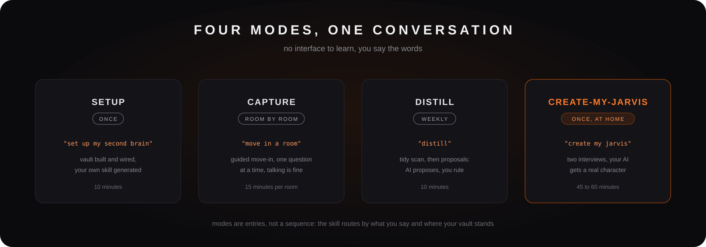
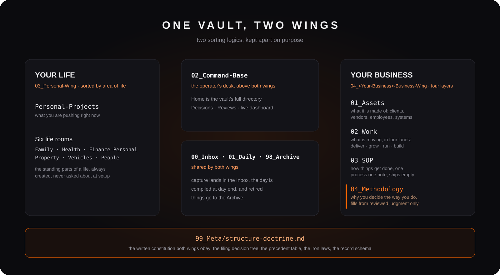
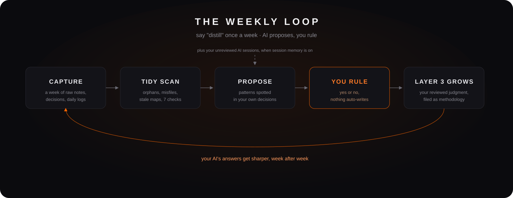
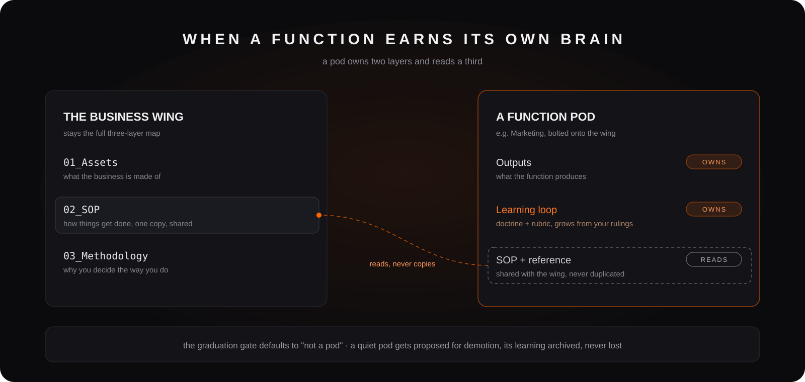

<p align="center">
  
</p>

# My Second Brain

**The one asset that stays yours no matter which AI model ships next quarter.**

A Claude Code skill that builds and runs a complete second brain for a business owner: one vault, two wings (your life in PARA, your business in a three-layer knowledge map), operated in plain conversation, with Obsidian as the viewing deck.

## Install

```bash
npx skills add breakthrough-edu/my-second-brain
```

Then open Claude Code and say:

> set up my second brain

Ten minutes later you are looking at the graph view of your half-built brain.

Already running it? Updating to the latest version is one line, and it never touches your vault, only the skill files:

```bash
npx skills update my-second-brain
```

## The idea underneath

AI execution is cheap now. What is scarce is your data having a home.

When your business lives in one structured vault, any AI can give you real answers about your own operation. When it lives in chat threads, receipts, and one employee's head, no model, however smart, can help you.

So this skill does not try to be the smartest assistant. It builds the thing underneath the assistant: a knowledge base in plain markdown files, structured by written law, owned by you. Models keep changing; your knowledge base stays yours. Your judgment and your operation are never locked into any single AI vendor, because the data layer is just files on your disk.

## What you get: four modes

<p align="center">
  
</p>

**Setup** (10 min). Installs Obsidian if needed, builds a fully wired vault (every room has a front desk, navigation live from day zero), asks 3 questions about your industry, offers an optional calendar connection so your morning brief sees the day's schedule, and generates a **personal command-base skill named after your business**. You install one skill; it builds you another one that only fits you.

**Capture** (15 min per room). Your Business Profile first, then one room at a time: clients, products, SOPs, whichever you pick. One question at a time, talking is fine, and there is a bulk lane when you already have material. Every session ends with one observation about your business you had not noticed, plus two good questions.

**Distill** (10 min weekly). The AI tidies the vault (orphans, misfiles, stale maps), then proposes distillations: decision patterns, lessons, rollups. You only rule yes or no. The third layer of your business map fills from your judgment, never from raw capture.

**Create-My-Jarvis** (45 to 60 min, at home). Two interviews, one about you and one about the character, that give your AI a real persona and a real understanding of who you are, so it stops sounding like a vending machine.

## The structure it builds

<p align="center">
  
</p>

```
Your-Vault/
├── 00_Inbox · 01_Daily            shared capture + timeline
├── 02-05  Projects/Areas/Resources/Archive     your life (PARA)
├── 06_Command-Base/               command center: Home, Decisions, Tasks, dashboard
├── 07_<Your-Business>/            your business, three layers:
│   ├── 01_Assets                  what it is made of (clients, products, docs, people)
│   ├── 02_SOP                     how things get done (named by intent, not department)
│   └── 03_Methodology             why you decide the way you do (fills from judgment)
└── 99_Meta/                       the constitution, templates, state
```

Two sorting axes, deliberately different. Your life is sorted by **actionability** (PARA). Your business is sorted by **knowledge type**: what it is made of, how things get done, why you decide the way you do. Mixing those two logics in one tree is how most vaults die; keeping them in separate wings is the core structural bet of this system.

## Day to day: living with it

After Setup, your daily driver is the command-base skill it generated for you. A normal day looks like this:

| You say | What happens |
|---|---|
| "morning" | A brief: today's schedule (if a calendar is connected), tasks due, red flags, who you are waiting on, business renewals coming up |
| "client X finally signed, closed at RM 4,500" | Captured on the spot, buffered durably, compiled into your daily note at end of day |
| "we decided to drop the entry-level package" | A structured decision record, filed in the central Decisions room with domain and reasoning |
| "follow up with the printer on Friday" | A waiting-for task that will resurface on its own |
| "how do we onboard a new hire again?" | Answered FROM your own SOP note, and if the answer reveals the SOP is stale, it gets updated in the same move |
| "compile" (end of day) | The day's captures become a dated daily note, business items append to the business log |
| "distill" (weekly, 10 min) | Vault hygiene scan, then distillation proposals for your methodology layer. You rule yes or no |

The handbook stays alive because answering and updating are the same motion. The vault stays trustworthy because every filing decision follows written law.

## The loop that keeps it alive

Most second brains die the same death: capture keeps adding, nothing ever settles, and three months in, the vault is a junk drawer the owner no longer trusts. The weekly Distill ritual is this system's answer, and it is where the compounding happens.

<p align="center">
  
</p>

Say "distill" once a week and four things happen, in order:

1. **Tidy scan.** Seven hygiene checks across the vault: orphan notes, misfiled items, stale maps, and the rest. The AI reports; files move only after you approve.
2. **Distillation proposals.** The AI reads the week's decisions, session logs, and daily notes, then proposes what they add up to: a decision pattern, a lesson, a rollup.
3. **You rule.** Yes or no on each proposal. Nothing writes itself into your methodology layer, ever.
4. **Layer 3 grows.** Approved distillations land in Methodology as your own reviewed judgment. The same scan also watches for functions that have earned a pod, or pods that have gone quiet.

This is the part most tools skip, because it cannot be automated away: the loop only compounds if a human keeps ruling. Ten minutes a week is the whole price. In exchange, the answers your AI gives you stop being generic, because they are grounded in what you actually decided, reviewed, and signed off on.

## Create-My-Jarvis: your AI gets a character

Out of the box, every AI assistant is the same person: helpful, generic, nobody's. The fourth mode is where that ends, and it is the part owners remember.

Two interviews, done at home in a quiet hour:

- **The profile interview** (ten questions) writes down who you actually are: how you really make hard decisions (the pattern, not the aspiration), what kind of criticism lands with you, what money does for you. Answers are transcribed near verbatim. Thin answers make a thin profile, and the skill says so instead of inventing personality to fill the gaps.
- **The soul interview** (eight beats) has you author a character: its name and why the name matters, what it should do first when you ship something hard, what it should do first when you are stuck, what it must never do, and at least three voice rules concrete enough to test a single sentence against.

A hard **genericness gate** protects the result. "Be clear and concise" fails the gate. "Never open with 'Great question'. If I write in Chinese, answer in Chinese. Tell me the risk before the plan." passes. When an answer lands generic, the interview pushes for the specific version, because a generic soul produces the same AI you already had.

What this buys you day to day:

- Your morning greeting sounds like the character, and its name surfacing is your proof the soul loaded.
- It holds your real situation in mind during routine work: the actual business, the actual stakes, in your own words.
- It deliberately watches the angles you told it you reliably miss, instead of mirroring you.
- The soul is a markdown file in your vault. Lived use will reshape it in the first weeks; you edit the file and the character follows.

## Design decisions

The choices that make this hold up over months, not weeks:

**The constitution lives in your vault, not in the skill.** Setup writes the full structural law (sorting axes, filing test sentences, iron laws, a rulings table for the genuinely ambiguous calls) to `99_Meta/structure-doctrine.md` inside your vault. Every filing decision reads it first and logs one line to `99_Meta/filing-log.md`. Swap the model, update the skill, the rules do not drift.

**The methodology layer cannot be filled by capture.** Layer 3 starts empty on purpose. Only reviewed judgment fills it: the AI proposes, you rule. A second brain that auto-generates your "methodology" is generating someone else's.

**Insights are observations, never verdicts.** Every capture session ends with one thing you had not noticed plus two good questions. The skill will not promise analytics your data cannot support yet, and it says so.

**Nothing nags.** Overdue maintenance, an uncompiled yesterday, the Jarvis offer: each is raised exactly once, then dropped. A tool that nags gets abandoned in three months, and this system is built for years.

**A crashed session loses nothing.** Every capture lands in a durable buffer file the moment it arrives. If the session dies before you compile, the next morning brief offers to backfill yesterday's note from the buffer.

**High-frequency rows never enter the vault.** Invoices, POs, attendance, receipts stay in the systems built for them; the vault stores pointers, exceptions, and monthly snapshots. This is a knowledge base, not a shadow ERP.

**Bilingual by craft, not by translation.** Interaction is English or 中文, your choice at setup. Chinese output follows native-writing discipline (no translated sentence structures), while folder names and frontmatter stay English so the structure is portable.

## Function pods: when a function earns its own brain

Most business functions stay simple: a room for their materials and a log. But some functions are pure repeated judgment (marketing, pricing, what to say no to), and those deserve to *learn*. When one has built up enough real track record, the companion `pod-maker` skill (installed at setup, symlinked so it updates with this skill) can **graduate** it into a pod.

A pod is not a whole separate business-in-a-box. Honestly sized, a pod **owns two layers** (its own outputs, and its own learning loop of doctrine and rubric that grows from your decisions) and **reads a third** (it shares the business wing's SOP and reference material, never duplicating them). The wing stays the full three-layer map; a pod is one function's local brain bolted onto it.

<p align="center">
  
</p>

Two guardrails keep this from bloating your vault: the graduation gate treats "not a pod" as the default answer (a process with a known right answer wants an SOP, not a learning loop), and the weekly maintenance scan proposes shrinking a pod back if it goes quiet (your learning is archived, never lost). One core pod ships ready to seed: **Marketing**, a generic marketing brain your own loop grows into something specific to your business.

## Honest boundaries

- Single-owner system: you plus your AI. Obsidian has no permission layers; if staff need a piece, export that piece.
- Not an ERP, not a CRM, not a multi-user wiki. Structured high-frequency data stays in the systems built for it.
- Early insights are observations, and the skill says so honestly. Depth comes from months of captured judgment, not from week one.

## Requirements

- [Claude Code](https://claude.com/claude-code)
- [Obsidian](https://obsidian.md) (free; the skill can install it for you). Enable the **Bases** core plugin for the dashboard.
- Works on macOS, Windows, Linux. English or 中文 interaction; your choice at setup.

## Repo layout

The skill payload lives in [`my-second-brain/`](my-second-brain/) (the nesting is what the `npx skills` installer ships as a unit: modes, templates, references, and the bundled `pod-maker` skill). `deck/` holds presentation material about the system.

## License

MIT. Built and maintained by [Breakthrough EDU](https://github.com/breakthrough-edu).
